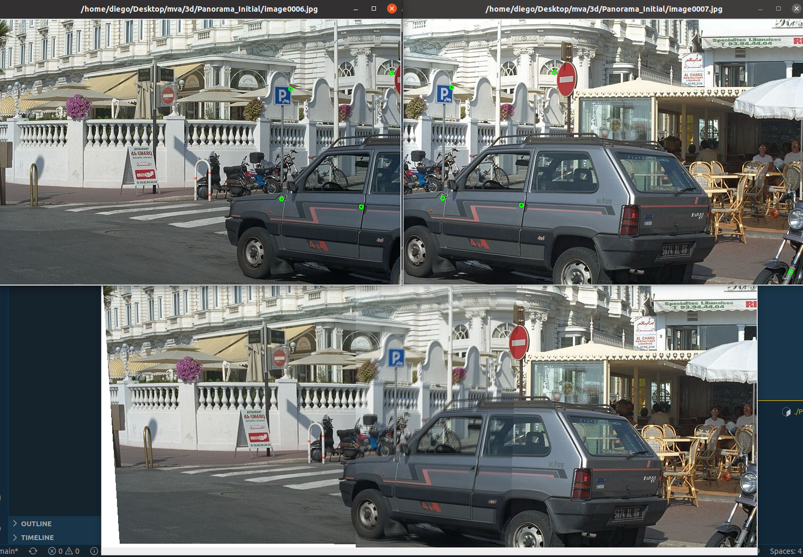

# Panorama Construction

The Homography matrix is obtained by solving the equations systems seen in class for Panorama construction. We need four points in each image that make a correspondence between them. The matrix obtained maps points from image 2 to image 1 and its inverse does the opossite. 

Having this mapping we can construct the whole Panorama starting from image 2 and extending it using the information of image 1 and the homography. For new pixels (the extension of image 2) we can see where this pixel would be in image 1 using the homography. The maped coordinates won't be integers so we have to also interpolate in image 1. This interpolated value is the one we need to extend image 2. In the parts of the image where image 1 and 2 overlap, we use the average value of both images.

Some results are shown below, using different points to make the correspondence in each case. An intersting thing to see is that $h_{31}$ and $h_{32}$ are always close to 0. This could mean that we are trying to estimate an affine transformation. Moreover, the H matrix obtained is always close to the following matrix:

$$
\begin{bmatrix}
1 &  0 & -460 \\
0 & 1 &  0 \\
0 & 0 & 1 \\
\end{bmatrix}
$$

This is just a translation of 460 px in the horizontal axis and works pretty well if we use it as the H matrix (See the third result with this H matrix). Some little rotations and transformations are calculated in the homography as well to exactly match the points that the user introduces as correspondences but most of it is just a translation.

## Examples

The first to examples are done by clicking corresponences in the images (green little circles). The third one is an estimation.
### 1

$$ \text{Estimated } H=
1.035 & 0.010 & -476.6 \\
0.005 & 1.061 & -8.1 \\
7.98 \times 10^{-6} & 1.235 \times 10^{-4} & 1 \\
\end{bmatrix}$$

### 2

$$ \text{Estimated } H=
\begin{bmatrix}
0.987 & -0.014 & -448.3 \\
-0.006 & 0.989 & 3.0 \\
-2.65 \times 10^{-5} & 1.15 \times 10 ^{-5} & 1 \\
\end{bmatrix}$$

### 3

Here we use a transformation that is only a translation. It is not perfect but is a good rough estimation of the transformation needed to do the panorama construction.

$$H=
\begin{bmatrix}
1 &  0 & -460 \\
0 & 1 &  0 \\
0 & 0 & 1 \\
\end{bmatrix}$$